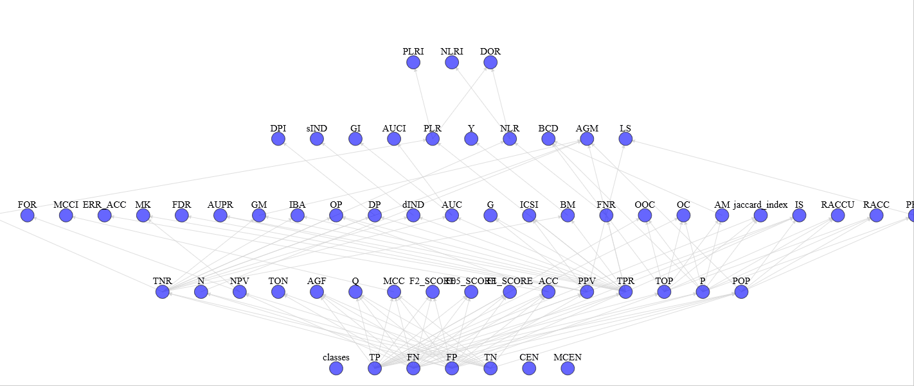

| **Authors**  | **Project** |  **Build Status** | **License** | **Code Quality** | **Coverage** |
|:------------:|:-----------:|:-----------------:|:-----------:|:----------------:|:------------:|
| [**N. Curti**](https://github.com/Nico-Curti) | **Scorer** | **Linux/MacOS** : [](https://travis-ci.com/Nico-Curti/scorer) <br/>  **Windows** : [](https://ci.appveyor.com/project/Nico-Curti/scorer) | [](https://github.com/Nico-Curti/Scorer/blob/master/LICENSE.md) | **Codacy** : [](https://www.codacy.com/manual/Nico-Curti/scorer?utm_source=github.com&amp;utm_medium=referral&amp;utm_content=Nico-Curti/scorer&amp;utm_campaign=Badge_Grade) <br/> **Codebeat** : [](https://codebeat.co/projects/github-com-nico-curti-scorer-master) | [](https://codecov.io/gh/Nico-Curti/scorer) |


[](https://github.com/Nico-Curti/scorer/pulls)
[](https://github.com/Nico-Curti/scorer/issues)

[](https://github.com/Nico-Curti/scorer/stargazers)
[](https://github.com/Nico-Curti/scorer/watchers)

# Machine Learning Scores

<a href="https://github.com/Nico-Curti/scorer/blob/master/img/scorer.pdf">
<div class="image">

</div>
</a>

Optimization and extension of the [**PyCM**](https://github.com/sepandhaghighi/pycm) library with c++ support and network dependencies.

1. [Getting Started](#getting-started)
2. [Prerequisites](#prerequisites)
3. [Usage](#usage)
4. [License](#license)
5. [Contribution](#contribution)
6. [Authors](#authors)
7. [Acknowledgments](#acknowledgments)
8. [Citation](#citation)

## Getting Started

To build the project you can use the [Makefile](https://github.com/Nico-Curti/scorer/blob/master/Makefile) or the [CMake](https://github.com/Nico-Curti/scorer/blob/master/CMakeLists.txt) (recommended).

In the first case you can see the whole set of available rules just typing `make` or `make example` to build the [example](https://github.com/Nico-Curti/scorer/blob/master/example/example.cpp) script in c++ or `make pythonic` to build the Cython version of the code.

The builds scripts ([build.sh](https://github.com/Nico-Curti/scorer/blob/master/build.sh) and [build.ps1](https://github.com/Nico-Curti/scorer/blob/master/build.ps1)) allow an automatic build of the full library in Windows and Linux/MacOS systems using CMake.

```bash
git clone https://github.com/Nico-Curti/scorer.git
cd scorer
./build.sh
```

For a manual installation of the Python version you can also run the [setup](https://github.com/Nico-Curti/scorer/blob/master/setup.py) script as

```bash
python -m pip install -r requirements.txt
python setup.py build_ext --inplace
```

or for developers

```bash
python -m pip install -r requirements.txt
python setup.py develop --user
```

If you are working without *root* privileges we suggest to use the [`Shut`](https://github.com/Nico-Curti/shut) scripts to easily install all the required dependencies.

## Prerequisites

To build the c++ version of the code at least c++14 is required.
C++ supported compilers:


Python version supported :


The OMP version of the code is automatically available if OMP is installed and in this way all the metric computations are performed in parallel according to the generated dependency graph.

The full list of prerequisites of Python version is listed in [requirements](https://github.com/Nico-Curti/scorer/blob/master/requirements.txt).

**Note**: if you are interested on the visualization of the dependency graph and some other utilities to manage the evaluated metrics you can find all the scripts in the [utils](https://github.com/Nico-Curti/scorer/tree/master/utils) folder.
In this case you need to install also the following Python packages:

```
networkx>=2.2
pandas>=0.23.3
matplotlib>=2.2.2
mpld3>=0.3
```

## Usage

You can use the libraries either inside your c++ project with a simple include of the [scorer.h](https://github.com/Nico-Curti/scorer/blob/master/include/scorer.h) header file or inside your Python application, where the scorer class is wrapped to give a simple dictionary in return.

If you use the c++ version *PAY ATTENTION* to the parallel environment (open the parallel region before the run of scores computation as shown in the following example code).

```c++
#include <array>
#include <scorer.h>

int main ()
{
  const int n_labels = 12;

  std :: array < int, n_labels > y_true = { {2, 0, 2, 2, 0, 1, 1, 2, 2, 0, 1, 2} };
  std :: array < int, n_labels > y_pred = { {0, 0, 2, 1, 0, 2, 1, 0, 2, 0, 2, 2} };

  scorer score;

#ifdef _OPENMP
#pragma omp parallel shared (score)
  {
#endif

    score.compute_score(y_true.data(), y_pred.data(), n_labels, n_labels);

#ifdef _OPENMP
  }
#endif

  score.print();

  return 0;
}
```

The same code can be rewritten in Python (also with different labels dtype) as

```python
#import numpy as np
from scorer import Scorer

y_true = ['a', 'b', 'a', 'a', 'b', 'c', 'c', 'a', 'a', 'b', 'c', 'a'] # np.array([2, 0, 2, 2, 0, 1, 1, 2, 2, 0, 1, 2], dtype=np.int32)
y_pred = ['b', 'b', 'a', 'c', 'b', 'a', 'c', 'b', 'a', 'b', 'a', 'a'] # np.array([0, 0, 2, 1, 0, 2, 1, 0, 2, 0, 2, 2], dtype=np.int32)

scorer = Scorer()
scorer.evaluate(y_true, y_pred)
print(scorer)
```

The output is the same in both the executions and it should be something like this

```bash
$ python ./scorer/example/main.py
Classes: 0, 1, 2
Confusion Matrix:
 3.0 0.0 0.0
 0.0 1.0 2.0
 2.0 1.0 3.0

Class Statistics:

TP(True positive/hit)                                                                           3.000                1.000                3.000
FN(False negative/miss/type 2 error)                                                            0.000                2.000                3.000
FP(False positive/type 1 error/false alarm)                                                     2.000                1.000                2.000
TN(True negative/correct rejection)                                                             7.000                8.000                4.000
POP(Population)                                                                                12.000               12.000               12.000
P(Condition positive or support)                                                                3.000                3.000                6.000
N(Condition negative)                                                                           9.000                9.000                6.000
TOP(Test outcome positive)                                                                      5.000                2.000                5.000
TON(Test outcome negative)                                                                      7.000               10.000                7.000
TPR(Sensitivity / recall / hit rate / true positive rate)                                       1.000                0.333                0.500
TNR(Specificity or true negative rate)                                                          0.778                0.889                0.667
PPV(Precision or positive predictive value)                                                     0.600                0.500                0.600
NPV(Negative predictive value)                                                                  1.000                0.800                0.571
FNR(Miss rate or false negative rate)                                                           0.000                0.667                0.500
FPR(Fall-out or false positive rate)                                                            0.222                0.111                0.333
FDR(False discovery rate)                                                                       0.400                0.500                0.400
FOR(False omission rate)                                                                        0.000                0.200                0.429
ACC(Accuracy)                                                                                   0.833                0.750                0.583
F1(F1 score - harmonic mean of precision and sensitivity)                                       0.750                0.400                0.545
F0.5(F0.5 score)                                                                                0.652                0.455                0.577
F2(F2 score)                                                                                    0.882                0.357                0.517
MCC(Matthews correlation coefficient)                                                           0.683                0.258                0.169
BM(Informedness or bookmaker informedness)                                                      0.778                0.222                0.167
MK(Markedness)                                                                                  0.600                0.300                0.171
PLR(Positive likelihood ratio)                                                                  4.500                3.000                1.500
NLR(Negative likelihood ratio)                                                                  0.000                0.750                0.750
DOR(Diagnostic odds ratio)                                                                        inf                4.000                2.000
PRE(Prevalence)                                                                                 0.250                0.250                0.500
G(G-measure geometric mean of precision and sensitivity)                                        0.775                0.408                0.548
RACC(Random accuracy)                                                                           0.104                0.042                0.208
ERR(Error rate)                                                                                 0.167                0.250                0.417
RACCU(Random accuracy unbiased)                                                                 0.111                0.043                0.210
J(Jaccard index)                                                                                0.600                0.250                0.375
IS(Information score)                                                                           1.263                1.000                0.263
CEN(Confusion entropy)                                                                          0.250                0.497                0.604
MCEN(Modified confusion entropy)                                                                0.264                0.500                0.688
AUC(Area Under the ROC curve)                                                                   0.889                0.611                0.583
dInd(Distance index)                                                                            0.222                0.676                0.601
sInd(Similarity index)                                                                          0.843                0.522                0.575
DP(Discriminant power)                                                                            inf                0.332                0.166
Y(Youden index)                                                                                 0.778                0.222                0.167
PLRI(Positive likelihood ratio interpretation)                                                   Poor                 Poor                 Poor
NLRI(Negative likelihood ratio interpretation)                                                   Good           Negligible           Negligible
DPI(Discriminant power interpretation)                                                           None                 Poor                 Poor
AUCI(AUC value interpretation)                                                              Very Good                 Fair                 Poor
GI(Gini index)                                                                                  0.778                0.222                0.167
LS(Lift score)                                                                                  2.400                2.000                1.200
AM(Difference between automatic and manual classification)                                      2.000               -1.000               -1.000
OP(Optimized precision)                                                                         0.708                0.295                0.440
IBA(Index of balanced accuracy)                                                                 0.951                0.132                0.278
GM(G-mean geometric mean of specificity and sensitivity)                                        0.882                0.544                0.577
Q(Yule Q - coefficient of colligation)                                                            nan                0.600                0.333
AGM(Adjusted geometric mean)                                                                    0.837                0.692                0.607
MCCI(Matthews correlation coefficient interpretation)                                        Moderate           Negligible           Negligible
AGF(Adjusted F-score)                                                                           0.914                0.540                0.552
OC(Overlap coefficient)                                                                         1.000                0.500                0.600
OOC(Otsuka-Ochiai coefficient)                                                                  0.775                0.408                0.548
AUPR(Area under the PR curve)                                                                   0.800                0.417                0.550
BCD(Bray-Curtis dissimilarity)                                                                  0.083                0.042                0.042
ICSI(Individual classification success index)                                                   0.600               -0.167                0.100

Overall Statistics:

Overall ACC                                                                      0.583
Overall RACCU                                                                    0.365
Overall RACC                                                                     0.354
Kappa                                                                            0.355
Scott PI                                                                         0.344
Get AC1                                                                          0.389
Bennett S                                                                        0.375
Kappa Standard Error                                                             0.220
Kappa Unbiased                                                                   0.344
Kappa No Prevalence                                                              0.167
Kappa 95% CI                                                                     (0.7867531180381775, -0.0770757719874382)
Standard Error                                                                   0.142
95% CI                                                                           (0.8622781038284302, 0.30438855290412903)
Chi-Squared                                                                      6.600
Phi-Squared                                                                      0.550
Cramer V                                                                         0.524
Response Entropy                                                                 1.483
Reference Entropy                                                                1.500
Cross Entropy                                                                    1.594
Joint Entropy                                                                    2.459
Conditional Entropy                                                              0.959
Mutual Information                                                               0.524
KL Divergence                                                                    0.094
Lambda B                                                                         0.429
Lambda A                                                                         0.167
Chi-Squared DF                                                                   4.000
Overall J                                                                        (1.225000023841858, 0.40833333134651184)
Hamming loss                                                                     0.417
Zero-one Loss                                                                    5.000
NIR                                                                              0.500
P-value                                                                          0.387
Overall CEN                                                                      0.464
Overall MCEN                                                                     0.519
Overall MCC                                                                      0.367
RR                                                                               4.000
CBA                                                                              0.478
AUNU                                                                             0.694
AUNP                                                                             0.667
RCI                                                                              0.349
Pearson C                                                                        0.596
F1 Micro                                                                         0.583
PPV Micro                                                                        0.583
TPR Micro                                                                        0.583
SOA1(Landis & Koch)                                                              Fair
SOA2(Fleiss)                                                                     Poor
SOA3(Altman)                                                                     Fair
SOA4(Cicchetti)                                                                  Poor
SOA5(Cramer)                                                                     Relatively Strong
SOA6(Matthews)                                                                   Weak
ACC Macro                                                                        0.722
F1 Macro                                                                         0.565
TPR Macro                                                                        0.611
PPV Macro                                                                        0.567
CSI                                                                              0.178
```

If you are working with non-integer labels the Scorer object provides a usefull `_label2numbers` (`encode` in C++) function.
Its usage is mandatory in `C++` since the function signature requires **only** integer (int32) values, while the `Python` version automatically encode/decode the labels according to requirements.

In the [utils](https://github.com/Nico-Curti/scorer/tree/master/utils) folder some utility scripts are reported.
The `make_script.py` allows to write the complete parallel version of the scorer class in c++.
In this way if you add a new operator to the library you can just run this code to update the scorer class parallelization strategies (computed in `dependency_graphs.py` script).

With `view_stats.py` you can see the complete graph of computed statistics with an HTML support for a more pleasant vision (e.g. [graph](https://github.com/Nico-Curti/scorer/blob/master/img/dependency_graph.gif))

**NOTE**: using `view_stats.py` you can find the error

```python
Object of type ndarray is not JSON serializable
```

I suggest to use the following command to overcome this `mpld3` issue:

```bash
python -m pip install --user "git+https://github.com/javadba/mpld3@display_fix"
```

A full list of informations about the score functions and their meaning can be found in the amazing [documentation](https://www.pycm.ir/doc/) of the original PyCM project.

## License

The `Scorer` package is licensed under the MIT "Expat" License. [](https://github.com/Nico-Curti/Scorer/blob/master/LICENSE.md)

## Contribution

Any contribution is more than welcome :heart:. Just fill an [issue](https://github.com/Nico-Curti/scorer/blob/master/ISSUE_TEMPLATE.md) or a [pull request](https://github.com/Nico-Curti/scorer/blob/master/PULL_REQUEST_TEMPLATE.md) and we will check ASAP!

See [here](https://github.com/Nico-Curti/scorer/blob/master/CONTRIBUTING.md) for further informations about how to contribute with this project.

## Authors

*  **Nico Curti** [git](https://github.com/Nico-Curti), [unibo](https://www.unibo.it/sitoweb/nico.curti2)

See also the list of [contributors](https://github.com/Nico-Curti/Scorer/contributors) [](https://github.com/Nico-Curti/scorer/graphs/contributors/) who participated to this project.

## Acknowledgments

Thanks goes to all contributors of this project:

| [<br /><sub><b>Daniele Dall'Olio</b></sub>](https://github.com/DanieleDallOlio)
|:---:|

### Citation

If you have found `Scorer` helpful in your research, please consider citing the project

```tex
@misc{Scorer,
  author = {Nico Curti},
  title = {Scorer},
  year = {2019},
  publisher = {GitHub},
  howpublished = {\url{https://github.com/Nico-Curti/scorer}},
}
```
