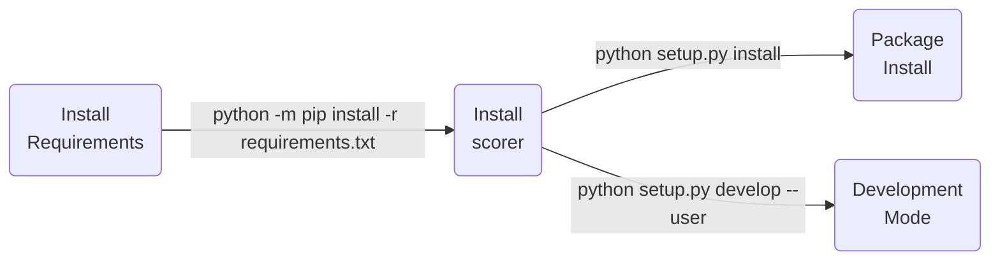

| **Authors**  | **Project** |  **Documentation** | **Build Status** | **License** | **Code Quality** | **Coverage** |
|:------------:|:-----------:|:------------------:|:----------------:|:-----------:|:----------------:|:------------:|
| [**N. Curti**](https://github.com/Nico-Curti) <br/> [**D. Dall'Olio**](https://github.com/DanieleDallOlio) | **Scorer** <br/> [](https://www.python.org/) <br/> [](https://cython.org/) <br/> [](https://isocpp.org/) | [](https://github.com/Nico-Curti/scorer/actions/workflows/docs.yml) <br/> [](https://scorer.readthedocs.io/en/latest/?badge=latest) | [](https://github.com/Nico-Curti/scorer/actions/workflows/linux.yml) <br/> [](https://github.com/Nico-Curti/scorer/actions/workflows/windows.yml)  <br/> [](https://github.com/Nico-Curti/scorer/actions/workflows/macos.yml) <br/> [](https://github.com/Nico-Curti/scorer/actions/workflows/python.yml) | [](https://github.com/Nico-Curti/Scorer/blob/master/LICENSE.md) | [](https://www.codacy.com/gh/Nico-Curti/scorer/dashboard?utm_source=github.com&amp;utm_medium=referral&amp;utm_content=Nico-Curti/scorer&amp;utm_campaign=Badge_Grade) <br/> [](https://codebeat.co/projects/github-com-nico-curti-scorer-master) | [](https://codecov.io/gh/Nico-Curti/scorer) |

[](https://github.com/Nico-Curti/scorer/pulls)
[](https://github.com/Nico-Curti/scorer/issues)
[](http://pepy.tech/count/scorer)
[](https://pypi.org/project/scorer/)

[](https://github.com/Nico-Curti/scorer/stargazers)
[](https://github.com/Nico-Curti/scorer/watchers)

# Machine Learning Scores

<a href="https://github.com/Nico-Curti/scorer/blob/master/img/scorer.pdf">
  <div class="image">
    
  </div>
</a>

We propose a `C++` version of the [**PyCM**](https://github.com/sepandhaghighi/pycm) Python package.
Our implementation optimizes and extends the original library including multi-threading support and an easy-to-use interface to the main algorithm.
To further improve the usage of our code, we propose also a `Python` wrap of the library with a full compatibility with the [`scikit-learn`](https://github.com/scikit-learn/scikit-learn) package.

* [Overview](#overview)
* [Getting Started](#getting-started)
* [Prerequisites](#prerequisites)
* [Installation](#installation)
* [Usage](#usage)
* [Testing](#testing)
* [Table of contents](#table-of-contents)
* [Contribution](#contribution)
* [References](#references)
* [FAQ](#faq)
* [Authors](#authors)
* [License](#license)
* [Acknowledgments](#acknowledgments)
* [Citation](#citation)

## Overview

The `Scorer` project implements a `scikit-learn` compatible set of machine-learning metric functions using a factor graph parallel environment.
The user interface of the library is generated fully automatically using a strict language formatting of the backend.
The dependency graph and the optimal parallelization strategy for the job splitting is automatically found in the pre-processing step, which leads to the creation of the library in both `C++` and `Python` language.
The wrap, via `Cython`, of the `C++` APIs guarantees an efficient computational time also in the `Python` applications.
The library provides easily extendible APIs and possible integrations with other projects.

A full list of informations about the score functions and their meaning can be found in the amazing [documentation](https://www.pycm.ir/doc/) of the original PyCM project.

## Getting Started

To build the project you can use the [Makefile](https://github.com/Nico-Curti/scorer/blob/master/Makefile) or the [CMake](https://github.com/Nico-Curti/scorer/blob/master/CMakeLists.txt) (**recommended**).

In the first case you can see the whole set of available rules just typing `make` or `make example` to build the [example](https://github.com/Nico-Curti/scorer/blob/master/example/example.cpp) script in c++ or `make pythonic` to build the Cython version of the code.

The builds scripts ([build.sh](https://github.com/Nico-Curti/scorer/blob/master/build.sh) and [build.ps1](https://github.com/Nico-Curti/scorer/blob/master/build.ps1)) allow an automatic build of the full library in Windows and Linux/MacOS systems using CMake.

```bash
git clone https://github.com/Nico-Curti/scorer.git
cd scorer
```

|              |  **Linux**    |  **MacOS**    |  **Windows**  |
|:------------:|:--------------|:--------------|:--------------|
| **Script**   | `./build.sh`  | `./build.sh`  | `./build.ps1` |

For a manual installation of the Python version you can also run the [setup](https://github.com/Nico-Curti/scorer/blob/master/setup.py) as:



If you are working without *root* privileges we suggest to use the [`Shut`](https://github.com/Nico-Curti/shut) scripts to easily install all the required dependencies.

| :warning: WARNING |
|:------------------|
| The installation of the `Python` modules requires the `CMake` support and all the listed above libraries.<br>If you are working under *Window OS* we require the usage of `VCPKG` for the installation of the libraries and a precise configuration of the environment variables.<br>In particular you need to set the variables `VCPKG_ROOT=/path/to/vcpkg/rootdir/` and `VCPKG_DEFAULT_TRIPLET=x64-windows`.<br>A full working example of OS configuration can be found in the CI actions of the project, available [here](https://github.com/Nico-Curti/scorer/blob/main/.github/workflows/) |

| :warning: WARNING |
|:------------------|
| All the `CMake` flags are set internally in the `setup.py` script with default values.<br>You can manually turn on/off the multi-threading support passing the flag `--omp` at the setup command line, *i.e.* `python setup.py develop --user --omp` |

## Prerequisites

To build the c++ version of the code at least c++14 is required.
C++ supported compilers:


Python version supported :


The OMP version of the code is available if OMP is installed (and the `-DOMP:BOOL=ON` flag is given to CMake) and in this way all the metric computations are performed in parallel according to the generated dependency graph.

The full list of prerequisites of Python version is listed in [requirements](https://github.com/Nico-Curti/scorer/blob/master/requirements.txt).

| :triangular_flag_on_post: Note |
|:-------------------------------|
| If you are interested on the visualization of the dependency graph and some other utilities to manage the evaluated metrics you can find all the scripts in the [utils](https://github.com/Nico-Curti/scorer/tree/master/utils) folder. |
| In this case you need to install also the following Python packages <ul><li>pandas>=0.23.3</li><li>matplotlib>=2.2.2</li><li>mpld3>=0.3</li></ul>|

| :warning: WARNING |
|:------------------|
| For both the Python and C++ installation of the library is required Python with the support of [`networkx`](https://networkx.github.io/) package. Thus, please configure your Python such as the CMake `find_package` function can find it and pay attention to install the `networkx` package for the auto-generation of the scorer object! |

## Installation

A complete list of instructions "for beginners" is also provided for both [c++](https://scorer.readthedocs.io/en/latest/CMake.html) and [python](https://scorer.readthedocs.io/en/latest/Python.html) versions.

If you are using the `CMake` (**recommended**) installer you obtain also the possibility to export the library.
The `CMake` command line can be customized according to the following parameters:

* `-DOMP:BOOL` : Enable/Disable the OpenMP support for multi-threading computation
* `-DBUILD_DOCS:BOOL` : Enable/Disable the build of docs using Doxygen and Sphinx
* `-DPYWRAP:BOOL` : Enable/Disable the build of Python wrap of the library via Cython (see next section for Python requirements)

| :triangular_flag_on_post: Note |
|:-------------------------------|
| All the variables above are set to `OFF` by default! |

After the installation you can use this library into other `CMake` projects using a simple `find_package` function.
The exported `CMake` library (`Scorer::scorer`) is installed in the `share/scorer` directory of the current project and the relative header files are available in the `include/scorer` folder.

The `CMake` installer provides also a `Scorer.pc`, useful if you want link to the `scorer` using `pkg-config`.

## Usage

You can use the libraries for both c++ projects, just including the [scorer.h](https://github.com/Nico-Curti/scorer/blob/master/include/scorer.h) header file, and Python applications, where the scorer class is wrapped as dictionary-like object.

If you use the c++ version *PAY ATTENTION* to the parallel environment (you have to open the parallel region before the run of scores computation as shown in the following example code).

```c++
#include <array>
#include <scorer.h>

int main ()
{
  const int32_t n_labels = 12;

  std :: array < int32_t, n_labels > y_true = { {2, 0, 2, 2, 0, 1, 1, 2, 2, 0, 1, 2} };
  std :: array < int32_t, n_labels > y_pred = { {0, 0, 2, 1, 0, 2, 1, 0, 2, 0, 2, 2} };

  scorer score;

#ifdef _OPENMP
#pragma omp parallel shared (score)
  {
#endif

    score.compute_score(y_true.data(), y_pred.data(), n_labels, n_labels);

#ifdef _OPENMP
  }
#endif

  score.print();

  return 0;
}
```

The same code can be rewritten in Python (also with different labels dtypes) as

```python
#import numpy as np
from scorer import Scorer

y_true = ['a', 'b', 'a', 'a', 'b', 'c', 'c', 'a', 'a', 'b', 'c', 'a']
# y_true = np.array([2, 0, 2, 2, 0, 1, 1, 2, 2, 0, 1, 2], dtype=np.int32)
y_pred = ['b', 'b', 'a', 'c', 'b', 'a', 'c', 'b', 'a', 'b', 'a', 'a']
# y_pred = np.array([0, 0, 2, 1, 0, 2, 1, 0, 2, 0, 2, 2], dtype=np.int32)

scorer = Scorer()
scorer.evaluate(y_true, y_pred)
print(scorer)
```

The output is the same in both the executions and it should be something like this

```
$ python ./scorer/example/main.py
Classes: a, b, c
Confusion Matrix:
 3.0 0.0 0.0
 0.0 1.0 2.0
 2.0 1.0 3.0

Class Statistics:

TP(True positive/hit)                                                                           3.000                1.000                3.000
FN(False negative/miss/type 2 error)                                                            0.000                2.000                3.000
FP(False positive/type 1 error/false alarm)                                                     2.000                1.000                2.000
TN(True negative/correct rejection)                                                             7.000                8.000                4.000
POP(Population)                                                                                12.000               12.000               12.000
P(Condition positive or support)                                                                3.000                3.000                6.000
N(Condition negative)                                                                           9.000                9.000                6.000
TOP(Test outcome positive)                                                                      5.000                2.000                5.000
TON(Test outcome negative)                                                                      7.000               10.000                7.000
TPR(Sensitivity / recall / hit rate / true positive rate)                                       1.000                0.333                0.500
TNR(Specificity or true negative rate)                                                          0.778                0.889                0.667
PPV(Precision or positive predictive value)                                                     0.600                0.500                0.600
NPV(Negative predictive value)                                                                  1.000                0.800                0.571
FNR(Miss rate or false negative rate)                                                           0.000                0.667                0.500
FPR(Fall-out or false positive rate)                                                            0.222                0.111                0.333
FDR(False discovery rate)                                                                       0.400                0.500                0.400
FOR(False omission rate)                                                                        0.000                0.200                0.429
ACC(Accuracy)                                                                                   0.833                0.750                0.583
F1(F1 score - harmonic mean of precision and sensitivity)                                       0.750                0.400                0.545
F0.5(F0.5 score)                                                                                0.652                0.455                0.577
F2(F2 score)                                                                                    0.882                0.357                0.517
MCC(Matthews correlation coefficient)                                                           0.683                0.258                0.169
BM(Informedness or bookmaker informedness)                                                      0.778                0.222                0.167
MK(Markedness)                                                                                  0.600                0.300                0.171
PLR(Positive likelihood ratio)                                                                  4.500                3.000                1.500
NLR(Negative likelihood ratio)                                                                  0.000                0.750                0.750
DOR(Diagnostic odds ratio)                                                                        inf                4.000                2.000
PRE(Prevalence)                                                                                 0.250                0.250                0.500
G(G-measure geometric mean of precision and sensitivity)                                        0.775                0.408                0.548
RACC(Random accuracy)                                                                           0.104                0.042                0.208
ERR(Error rate)                                                                                 0.167                0.250                0.417
RACCU(Random accuracy unbiased)                                                                 0.111                0.043                0.210
J(Jaccard index)                                                                                0.600                0.250                0.375
IS(Information score)                                                                           1.263                1.000                0.263
CEN(Confusion entropy)                                                                          0.250                0.497                0.604
MCEN(Modified confusion entropy)                                                                0.264                0.500                0.688
AUC(Area Under the ROC curve)                                                                   0.889                0.611                0.583
dInd(Distance index)                                                                            0.222                0.676                0.601
sInd(Similarity index)                                                                          0.843                0.522                0.575
DP(Discriminant power)                                                                            inf                0.332                0.166
Y(Youden index)                                                                                 0.778                0.222                0.167
PLRI(Positive likelihood ratio interpretation)                                                   Poor                 Poor                 Poor
NLRI(Negative likelihood ratio interpretation)                                                   Good           Negligible           Negligible
DPI(Discriminant power interpretation)                                                           None                 Poor                 Poor
AUCI(AUC value interpretation)                                                              Very Good                 Fair                 Poor
GI(Gini index)                                                                                  0.778                0.222                0.167
LS(Lift score)                                                                                  2.400                2.000                1.200
AM(Difference between automatic and manual classification)                                      2.000               -1.000               -1.000
OP(Optimized precision)                                                                         0.708                0.295                0.440
IBA(Index of balanced accuracy)                                                                 0.951                0.132                0.278
GM(G-mean geometric mean of specificity and sensitivity)                                        0.882                0.544                0.577
Q(Yule Q - coefficient of colligation)                                                            nan                0.600                0.333
AGM(Adjusted geometric mean)                                                                    0.837                0.692                0.607
MCCI(Matthews correlation coefficient interpretation)                                        Moderate           Negligible           Negligible
AGF(Adjusted F-score)                                                                           0.914                0.540                0.552
OC(Overlap coefficient)                                                                         1.000                0.500                0.600
OOC(Otsuka-Ochiai coefficient)                                                                  0.775                0.408                0.548
AUPR(Area under the PR curve)                                                                   0.800                0.417                0.550
BCD(Bray-Curtis dissimilarity)                                                                  0.083                0.042                0.042
ICSI(Individual classification success index)                                                   0.600               -0.167                0.100

Overall Statistics:

Overall ACC                                                                      0.583
Overall RACCU                                                                    0.365
Overall RACC                                                                     0.354
Kappa                                                                            0.355
Scott PI                                                                         0.344
Gwet AC1                                                                         0.389
Bennett S                                                                        0.375
Kappa Standard Error                                                             0.220
Kappa Unbiased                                                                   0.344
Kappa No Prevalence                                                              0.167
Kappa 95% CI                                                                     (0.7867531180381775, -0.0770757719874382)
Standard Error                                                                   0.142
95% CI                                                                           (0.8622781038284302, 0.30438855290412903)
Chi-Squared                                                                      6.600
Phi-Squared                                                                      0.550
Cramer V                                                                         0.524
Response Entropy                                                                 1.483
Reference Entropy                                                                1.500
Cross Entropy                                                                    1.594
Joint Entropy                                                                    2.459
Conditional Entropy                                                              0.959
Mutual Information                                                               0.524
KL Divergence                                                                    0.094
Lambda B                                                                         0.429
Lambda A                                                                         0.167
Chi-Squared DF                                                                   4.000
Overall J                                                                        (1.225000023841858, 0.40833333134651184)
Hamming loss                                                                     0.417
Zero-one Loss                                                                    5.000
NIR                                                                              0.500
P-value                                                                          0.387
Overall CEN                                                                      0.464
Overall MCEN                                                                     0.519
Overall MCC                                                                      0.367
RR                                                                               4.000
CBA                                                                              0.478
AUNU                                                                             0.694
AUNP                                                                             0.667
RCI                                                                              0.349
Pearson C                                                                        0.596
F1 Micro                                                                         0.583
PPV Micro                                                                        0.583
TPR Micro                                                                        0.583
SOA1(Landis & Koch)                                                              Fair
SOA2(Fleiss)                                                                     Poor
SOA3(Altman)                                                                     Fair
SOA4(Cicchetti)                                                                  Poor
SOA5(Cramer)                                                                     Relatively Strong
SOA6(Matthews)                                                                   Weak
ACC Macro                                                                        0.722
F1 Macro                                                                         0.565
TPR Macro                                                                        0.611
PPV Macro                                                                        0.567
CSI                                                                              0.178
```

If you are working with non-integer labels, the Scorer object provides a usefull `_label2numbers` (`encode` in C++) function.
Its usage is mandatory in `C++` since the function signature requires **only** integer (int32_t) values, while the `Python` version automatically encode/decode the labels according to requirements.

In the [utils](https://github.com/Nico-Curti/scorer/tree/master/utils) folder some utility scripts are reported.
The `make_script.py` allows to write the complete parallel version of the scorer class in c++.
In this way if you add a new operator to the library you can just run this code to update the scorer class parallelization strategies (computed in `dependency_graphs.py` script).

With `view_stats.py` you can see the complete graph of computed statistics with an HTML support for a more pleasant vision (e.g. [graph](https://github.com/Nico-Curti/scorer/blob/master/img/dependency_graph.gif))
A full list of informations about the score functions and their meaning can be found in the amazing [documentation](https://www.pycm.ir/doc/) of the original PyCM project.

## Testing

The Python version of the package is tested using [`pytest`](https://docs.pytest.org/en/latest/).
To install the package in development mode you need to add also this requirement:

* pytest == 3.0.7
* hypothesis == 4.13.0

The full list of python test scripts can be found [here](https://github.com/Nico-Curti/scorer/blob/master/testing).

## Table of contents

Description of the folders related to the `C++` version.

| **Directory**  |  **Description** |
|:--------------:|:-----------------|
| [example](https://github.com/Nico-Curti/scorer/blob/master/example) | List of example usages for the C++ version of the code.                      |
| [include](https://github.com/Nico-Curti/scorer/blob/master/include) | Definition of the C++ function and objects used in the `scorer` library      |
| [src](https://github.com/Nico-Curti/scorer/blob/master/src)         | Implementation of the C++ functions and objects used in the `scorer` library |

Description of the folders related to the `Python` version (base directory `scorer`).

| **Directory**  |  **Description** |
|:--------------:|:-----------------|
| [example](https://github.com/Nico-Curti/scorer/blob/master/scorer/example) | `Python` version of the `C++` examples. |
| [lib](https://github.com/Nico-Curti/scorer/blob/master/scorer/lib)         | List of `Cython` definition files       |
| [source](https://github.com/Nico-Curti/scorer/blob/master/scorer/source)   | List of `Cython` implementation objects |
| [scorer](https://github.com/Nico-Curti/scorer/blob/master/scorer/scorer)   | List of `Python` wraps                  |

## Contribution

Any contribution is more than welcome :heart:. Just fill an [issue](https://github.com/Nico-Curti/scorer/blob/master/.github/ISSUE_TEMPLATE/ISSUE_TEMPLATE.md) or a [pull request](https://github.com/Nico-Curti/scorer/blob/master/.github/PULL_REQUEST_TEMPLATE/PULL_REQUEST_TEMPLATE.md) and we will check ASAP!

See [here](https://github.com/Nico-Curti/scorer/blob/master/.github/CONTRIBUTING.md) for further informations about how to contribute with this project.

## References

<blockquote>1- Haghighi, S., Jasemi, M., Hessabi, S. and Zolanvari, A. (2018). PyCM: Multiclass confusion matrix library in Python. Journal of Open Source Software, 3(25), p.729. </blockquote>

## FAQ

* **How can I properly set the C++ compiler for the Python installation?**

If you are working on a Ubuntu machine pay attention to properly set the environment variables related to the `C++` compiler.
First of all take care to put the compiler executable into your environmental path:

```bash
ls -ltA /usr/bin | grep g++
```

Then you can simply use the command to properly set the right aliases/variables

```bash
export CXX=/usr/bin/g++
export CC=/usr/bin/gcc
```

but I suggest you to put those lines into your `.bashrc` file (one for all):

```bash
echo "export CC=/usr/bin/gcc" >> ~/.bashrc
echo "export CXX=/usr/bin/g++" >> ~/.bashrc
```

I suggest you to not use the default `Python` compiler (aka `x86_64-linux-gnu-g++`) since it can suffer of many issues during the compilation if it is not manually customized.

**Note:** If you are working under Windows OS a complete guide on how to properly configure your MSVC compiler can be found [here](https://github.com/physycom/sysconfig).

* **I installed the `scorer` Python package following the instructions but I have an `ImportError` when I try to import the package as in the examples**

This error is due a missing environment variable (which is not automatically set by the installation script).
All the `C++` libraries are searched into the OS directory tree starting from the information/paths hinted by the `LD_LIBRARY_PATH` environment variable.
When you install the `scorer` library the produced `.so`, `.dll`, `.dylib` files are saved into the `lib` directory created into the project root directory.
After the installation you must add this directory into the searching path.
You can add this information editing the configuration file of your `Unix`-like system, i.e

```bash
echo "export LD_LIBRARY_PATH=$LD_LIBRARY_PATH:/path/to/scorer/project/directory/lib/" >> ~/.bashrc
echo "export DYLD_LIBRARY_PATH=$DYLD_LIBRARY_PATH:/path/to/scorer/project/directory/lib/" >> ~/.bashrc
```

or adding the `LD_LIBRARY_PATH` to your set of environment variables (especially for `Windows` users).

* **I run the `view_stats.py` script but I get an Error**

Probably the error you get is something like

```python
Object of type ndarray is not JSON serializable
```

In this case, we suggest to use the following command to overcome this `mpld3` issue:

```bash
python -m pip install --user "git+https://github.com/javadba/mpld3@display_fix"
```

* **How can I install the library via `VCPKG` dependency manager?**

The `scorer` library is not yet supported via `vcpkg` (I have not submitted any PR yet).
However, in the [`cmake`](https://github.com/Nico-Curti/scorer/blob/master/cmake) folder you can find a complete directory-tree named `vcpkg`.
You can simply copy&paste the entire `vcpkg` folder over the original (cloned [here](https://github.com/microsoft/vcpkg)) project to manage the entire installation of the library *also* via vcpkg.

| :triangular_flag_on_post: Note |
|:-------------------------------|
| Since no releases have been published yet, the [`portfile`](https://github.com/Nico-Curti/scorer/blob/master/cmake/ports/scorer/portfile.cmake) is not complete and you need to manually set the `REF` and `SHA512` variables! |

## Authors

*  **Nico Curti** [git](https://github.com/Nico-Curti), [unibo](https://www.unibo.it/sitoweb/nico.curti2)
*  **Daniele Dall'Olio** [git](https://github.com/DanieleDallOlio), [unibo](https://www.unibo.it/sitoweb/daniele.dallolio)

See also the list of [contributors](https://github.com/Nico-Curti/Scorer/contributors) [](https://github.com/Nico-Curti/scorer/graphs/contributors/) who participated to this project.

## License

The `Scorer` package is licensed under the MIT "Expat" License. [](https://github.com/Nico-Curti/Scorer/blob/master/LICENSE)

## Acknowledgments

Thanks goes to all contributors of this project.

### Citation

If you have found `Scorer` helpful in your research, please consider citing the project

```BibTeX
@misc{Scorer,
  author = {Nico Curti \& Daniele Dall'Olio},
  title = {Scorer},
  year = {2019},
  publisher = {GitHub},
  howpublished = {\url{https://github.com/Nico-Curti/scorer}},
}
```
