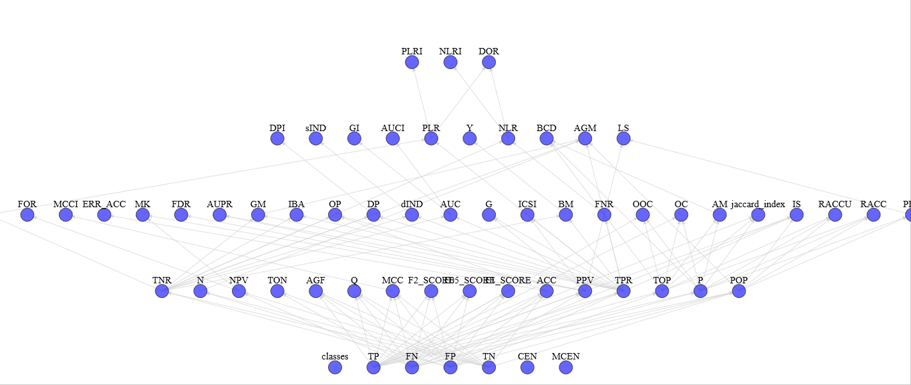

.. Scorer algorithm documentation master file, created by
   sphinx-quickstart on Fri Oct  2 12:42:24 2020.
   You can adapt this file completely to your liking, but it should at least
   contain the root `toctree` directive.

Welcome to scorer's documentation!
==================================================================

Optimization and extension of the PyCM_ library with c++ support and network dependencies.

Usage example
=============

You can use the `scorer` algorithm into pure-Python modules or inside your C++ application.

C++ example
-----------

You can use the libraries either inside your c++ project with a simple include of the `scorer.h`_ header file or inside your Python application, where the scorer class is wrapped to give a simple dictionary in return.

If you use the c++ version **PAY ATTENTION** to the parallel environment (open the parallel region before the run of scores computation as shown in the following example code).

.. code-block:: c++

	#include <array>
	#include <scorer.h>

	int main ()
	{
	  const int n_labels = 12;

	  std :: array < int, n_labels > y_true = { {2, 0, 2, 2, 0, 1, 1, 2, 2, 0, 1, 2} };
	  std :: array < int, n_labels > y_pred = { {0, 0, 2, 1, 0, 2, 1, 0, 2, 0, 2, 2} };

	  scorer score;

	#ifdef _OPENMP
	#pragma omp parallel shared (score)
	  {
	#endif

	    score.compute_score(y_true.data(), y_pred.data(), n_labels, n_labels);

	#ifdef _OPENMP
	  }
	#endif

	  score.print();

	  return 0;
	}

Python example
--------------

The same code can be rewritten in Python (also with different labels dtype) as

.. code-block:: python

	#import numpy as np
	from scorer import Scorer

	y_true = ['a', 'b', 'a', 'a', 'b', 'c', 'c', 'a', 'a', 'b', 'c', 'a']
	# np.array([2, 0, 2, 2, 0, 1, 1, 2, 2, 0, 1, 2], dtype=np.int32)
	y_pred = ['b', 'b', 'a', 'c', 'b', 'a', 'c', 'b', 'a', 'b', 'a', 'a']
	# np.array([0, 0, 2, 1, 0, 2, 1, 0, 2, 0, 2, 2], dtype=np.int32)

	scorer = Scorer()
	scorer.evaluate(y_true, y_pred)
	print(scorer)

The output is the same in both the executions and it should be something like this

.. code-block:: bash

	$ python ./scorer/example/main.py
	Classes: 0, 1, 2
	Confusion Matrix:
	 3.0 0.0 0.0
	 0.0 1.0 2.0
	 2.0 1.0 3.0

	Class Statistics:

	TP(True positive/hit)                                                                           3.000                1.000                3.000
	FN(False negative/miss/type 2 error)                                                            0.000                2.000                3.000
	FP(False positive/type 1 error/false alarm)                                                     2.000                1.000                2.000
	TN(True negative/correct rejection)                                                             7.000                8.000                4.000
	POP(Population)                                                                                12.000               12.000               12.000
	P(Condition positive or support)                                                                3.000                3.000                6.000
	N(Condition negative)                                                                           9.000                9.000                6.000
	TOP(Test outcome positive)                                                                      5.000                2.000                5.000
	TON(Test outcome negative)                                                                      7.000               10.000                7.000
	TPR(Sensitivity / recall / hit rate / true positive rate)                                       1.000                0.333                0.500
	TNR(Specificity or true negative rate)                                                          0.778                0.889                0.667
	PPV(Precision or positive predictive value)                                                     0.600                0.500                0.600
	NPV(Negative predictive value)                                                                  1.000                0.800                0.571
	FNR(Miss rate or false negative rate)                                                           0.000                0.667                0.500
	FPR(Fall-out or false positive rate)                                                            0.222                0.111                0.333
	FDR(False discovery rate)                                                                       0.400                0.500                0.400
	FOR(False omission rate)                                                                        0.000                0.200                0.429
	ACC(Accuracy)                                                                                   0.833                0.750                0.583
	F1(F1 score - harmonic mean of precision and sensitivity)                                       0.750                0.400                0.545
	F0.5(F0.5 score)                                                                                0.652                0.455                0.577
	F2(F2 score)                                                                                    0.882                0.357                0.517
	MCC(Matthews correlation coefficient)                                                           0.683                0.258                0.169
	BM(Informedness or bookmaker informedness)                                                      0.778                0.222                0.167
	MK(Markedness)                                                                                  0.600                0.300                0.171
	PLR(Positive likelihood ratio)                                                                  4.500                3.000                1.500
	NLR(Negative likelihood ratio)                                                                  0.000                0.750                0.750
	DOR(Diagnostic odds ratio)                                                                        inf                4.000                2.000
	PRE(Prevalence)                                                                                 0.250                0.250                0.500
	G(G-measure geometric mean of precision and sensitivity)                                        0.775                0.408                0.548
	RACC(Random accuracy)                                                                           0.104                0.042                0.208
	ERR(Error rate)                                                                                 0.167                0.250                0.417
	RACCU(Random accuracy unbiased)                                                                 0.111                0.043                0.210
	J(Jaccard index)                                                                                0.600                0.250                0.375
	IS(Information score)                                                                           1.263                1.000                0.263
	CEN(Confusion entropy)                                                                          0.250                0.497                0.604
	MCEN(Modified confusion entropy)                                                                0.264                0.500                0.688
	AUC(Area Under the ROC curve)                                                                   0.889                0.611                0.583
	dInd(Distance index)                                                                            0.222                0.676                0.601
	sInd(Similarity index)                                                                          0.843                0.522                0.575
	DP(Discriminant power)                                                                            inf                0.332                0.166
	Y(Youden index)                                                                                 0.778                0.222                0.167
	PLRI(Positive likelihood ratio interpretation)                                                   Poor                 Poor                 Poor
	NLRI(Negative likelihood ratio interpretation)                                                   Good           Negligible           Negligible
	DPI(Discriminant power interpretation)                                                           None                 Poor                 Poor
	AUCI(AUC value interpretation)                                                              Very Good                 Fair                 Poor
	GI(Gini index)                                                                                  0.778                0.222                0.167
	LS(Lift score)                                                                                  2.400                2.000                1.200
	AM(Difference between automatic and manual classification)                                      2.000               -1.000               -1.000
	OP(Optimized precision)                                                                         0.708                0.295                0.440
	IBA(Index of balanced accuracy)                                                                 0.951                0.132                0.278
	GM(G-mean geometric mean of specificity and sensitivity)                                        0.882                0.544                0.577
	Q(Yule Q - coefficient of colligation)                                                            nan                0.600                0.333
	AGM(Adjusted geometric mean)                                                                    0.837                0.692                0.607
	MCCI(Matthews correlation coefficient interpretation)                                        Moderate           Negligible           Negligible
	AGF(Adjusted F-score)                                                                           0.914                0.540                0.552
	OC(Overlap coefficient)                                                                         1.000                0.500                0.600
	OOC(Otsuka-Ochiai coefficient)                                                                  0.775                0.408                0.548
	AUPR(Area under the PR curve)                                                                   0.800                0.417                0.550
	BCD(Bray-Curtis dissimilarity)                                                                  0.083                0.042                0.042
	ICSI(Individual classification success index)                                                   0.600               -0.167                0.100

	Overall Statistics:

	Overall ACC                                                                      0.583
	Overall RACCU                                                                    0.365
	Overall RACC                                                                     0.354
	Kappa                                                                            0.355
	Scott PI                                                                         0.344
	Get AC1                                                                          0.389
	Bennett S                                                                        0.375
	Kappa Standard Error                                                             0.220
	Kappa Unbiased                                                                   0.344
	Kappa No Prevalence                                                              0.167
	Kappa 95% CI                                                                     (0.7867531180381775, -0.0770757719874382)
	Standard Error                                                                   0.142
	95% CI                                                                           (0.8622781038284302, 0.30438855290412903)
	Chi-Squared                                                                      6.600
	Phi-Squared                                                                      0.550
	Cramer V                                                                         0.524
	Response Entropy                                                                 1.483
	Reference Entropy                                                                1.500
	Cross Entropy                                                                    1.594
	Joint Entropy                                                                    2.459
	Conditional Entropy                                                              0.959
	Mutual Information                                                               0.524
	KL Divergence                                                                    0.094
	Lambda B                                                                         0.429
	Lambda A                                                                         0.167
	Chi-Squared DF                                                                   4.000
	Overall J                                                                        (1.225000023841858, 0.40833333134651184)
	Hamming loss                                                                     0.417
	Zero-one Loss                                                                    5.000
	NIR                                                                              0.500
	P-value                                                                          0.387
	Overall CEN                                                                      0.464
	Overall MCEN                                                                     0.519
	Overall MCC                                                                      0.367
	RR                                                                               4.000
	CBA                                                                              0.478
	AUNU                                                                             0.694
	AUNP                                                                             0.667
	RCI                                                                              0.349
	Pearson C                                                                        0.596
	F1 Micro                                                                         0.583
	PPV Micro                                                                        0.583
	TPR Micro                                                                        0.583
	SOA1(Landis & Koch)                                                              Fair
	SOA2(Fleiss)                                                                     Poor
	SOA3(Altman)                                                                     Fair
	SOA4(Cicchetti)                                                                  Poor
	SOA5(Cramer)                                                                     Relatively Strong
	SOA6(Matthews)                                                                   Weak
	ACC Macro                                                                        0.722
	F1 Macro                                                                         0.565
	TPR Macro                                                                        0.611
	PPV Macro                                                                        0.567
	CSI

If you are working with non-integer labels the Scorer object provides a usefull `_label2numbers` (`encode` in C++) function.
Its usage is mandatory in `C++` since the function signature requires **only** integer (int32) values, while the `Python` version automatically encode/decode the labels according to requirements.

In the utils_ folder some utility scripts are reported.
The `make_script.py` allows to write the complete parallel version of the scorer class in c++.
In this way if you add a new operator to the library you can just run this code to update the scorer class parallelization strategies (computed in `dependency_graphs.py` script).

With `view_stats.py` you can see the complete graph of computed statistics with an HTML support for a more pleasant vision (e.g. graph_)

.. warning::
	using `view_stats.py` you can find the error

	>>> Object of type ndarray is not JSON serializable

	I suggest to use the following command to overcome this `mpld3` issue:

	>>> python -m pip install --user "git+https://github.com/javadba/mpld3@display_fix"

.. _PyCM: https://github.com/sepandhaghighi/pycm
.. _`scorer.h` : https://github.com/Nico-Curti/scorer/blob/master/include/scorer.h
.. _utils: https://github.com/Nico-Curti/scorer/tree/master/utils
.. _graph: https://github.com/Nico-Curti/scorer/blob/master/img/dependency_graph.gif

.. toctree::
   :maxdepth: 2
   :caption: Contents:

   theory
   installation
   cppAPI/modules
   pyAPI/modules
   references